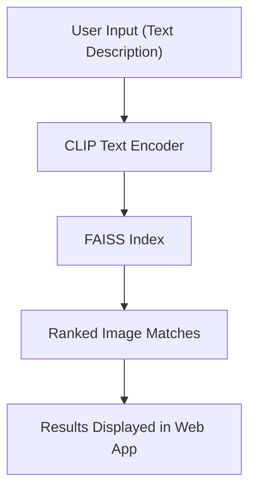

# AI-Powered-Image-Search-App
A web application that uses OpenAI’s CLIP model and FAISS to enable text-based image search. Users can describe an image in plain lanuage, and the app retrieves the most relevant images from a local folder in real time.

## Features
- Text-to-Image Search using OpenAI’s CLIP model for semantic embeddings by transforming data into vectors in a high-dimensional space
- Fast Image Retrieval with FAISS vector similarity search
- Automatic Image Preprocessing with Pillow (PIL)
- Flask Webb App with a HTML interface for queries and results
- GPU/CPU acceleration supported by Pytorch

## How it Works
1. Load a collection of images from a folder (like photos/)
2. Generates image embeddings using CLIP
3. Index embeddings in FAISS is used for fast similarity search
4. User enters a text query that describes the image they want
5. App retrieves top matching images based on vector similarity

## Tech Stack
| Layer          | Technology                            |
| -------------- | ------------------------------------- |
| Backend        | Python, Flask                         |
| ML Model       | OpenAI CLIP (via Hugging Face)        |
| Search Engine  | FAISS (Facebook AI Similarity Search) |
| Image Handling | Pillow (PIL)                          |
| Frontend       | HTML (via Flask templates)            |

## Running the App Locally
1. Clone the repo
```bash
git clone https://github.com/your-username/image-search-app.git
cd image-search-app
```
2. Install dependencies
```bash
pip install flask torch torchvision faiss-cpu pillow transformers
```
3. Add images
Put all of your .jpg/.png images into a photos/ folder or any other folder of your choosing.
4. Start the app
```bash
python app.py
```
5. Search for images
Open http://127.0.0.1:5000 in your browser, type in a description like "cute smiling puppies," and see the displayed images that match your input.

** Simple Data Flow

